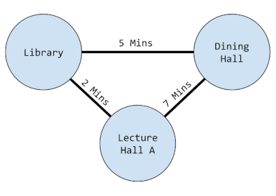
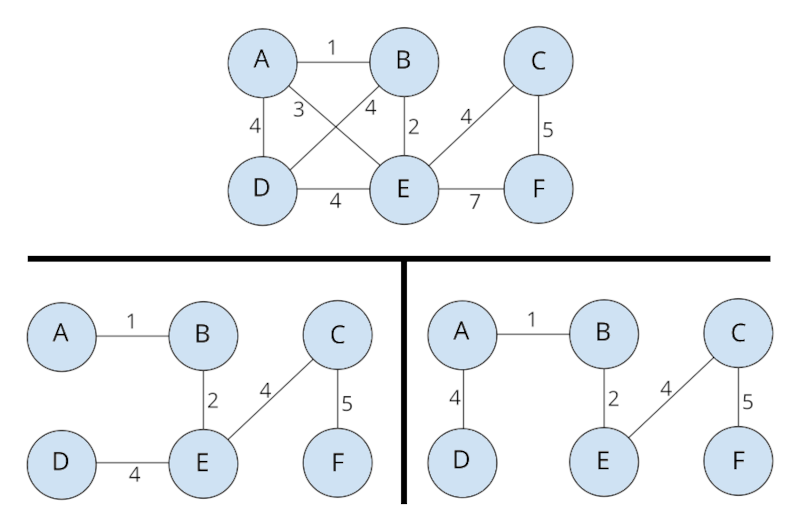

# Minimum Spanning Tree (MST)

## Overview

You will be building a program that reads in an undirected graph and outputs the cost of a Minimum Spanning Tree (MST) over that graph.

## Background

This section provides some additional details that may help you understand the scenario.
Any information provided here is not necessary to solving this problem.

### Graphs

A graph is a structure that contains objects called **nodes** (or vertices) connected by objects called **edges**.
Nodes often have some id or data associated with it, and edges often have a weight (a number associated with the cost to use/traverse this edge).
For example, we may represent various location on a school campus as nodes in a graph, and edges as the average time it takes to walk between those two location.

There are infinite ways a graph can be used and dozens (if not hundreds) of formal definitions of specific types of graphs
(e.g., "Directed Acyclic Graph", "Bipartite Graph", or "Markov Chain").
In this problem, we will only use very basic graphs and will not refer to any type of graph by its formal name.

Graphs in this problem will be "undirected",
meaning that the edges can be followed from either direction.

### Minimum Spanning Trees

A "Spanning Tree" is a subset of edges that connect all nodes in a graph.
A "Minimum Spanning Tree" (MST) a spanning tree with the lowest possible sum of edge weights.
You can think of it as one of the lowest cost paths through a graph.

Consider the above example graph that represents locations on a school campus.
If you had to visit all three location and you could be dropped off at one of them,
then an MST would tell you how to get to each location with the shortest time spent walking.

The example below (provided by [Wikimedia](https://en.wikipedia.org/wiki/File:Multiple_minimum_spanning_trees.svg)),
You can see that the base graph (on the top) has two possible MSTs (on the bottom).

We can refer to the sum of all edge weights in an MST the MST's "cost" or "weight".

## Details

Your program should:

 - Read in the graph on stdin.
   - See the [Input Format section](#input-format) for details.
 - Compute a Minimum Spanning Tree (MST) for the given undirected graph.
 - Output a single line containing the cost of the MST (the summed weight of all edges participating in the MST).

### Input Format

The graph will be provided as a series of edges,
with each edge on its own line.
Lines may contain starting or trailing whitespace, that whitespace should be ignored.
Ignore any lines that are empty or include only whitespace.
An EOF (end of file), will signal that there are no more edges to read.

Each line containing an edge will have three values (in order) separated by a tab character (`\t`):

 - A node identifier.
 - An edge weight.
 - A node identifier.

For example, the line `A\t10\tB` indicates that node A is connected to node B via an edge of weight 10.

## Clarifications

 - Input
   - Lines & Whitespace
     - A "line" is a string terminated with a newline character.
       - The final line of input may  be terminated by an EOF (End-of-File).
       - Carriage returns are not recognized as terminating characters in this contest,
         i.e., this contest uses POSIX-style (not Windows-style) line endings.
     - Only ASCII characters will be sent on stdin.
       - Treating input as ASCII or UTF-8 strings should result in the same output.
     - "Whitespace" will be considered any ASCII whitespace (see the table below).
     - A "non-empty" string is a string that contains any character and does not include any terminating null byte.
     - A non-empty line will always have a full edge on it.
     - There will be no **extra** whitespace between the two nodes on a line,
       i.e., the tab delimiters will be there but nothing else will separate the nodes from the edge weight.
   - Nodes
     - Node IDs will be uppercase alphabetic (US English) letters.
       - These characters fall in the range of ASCII characters from 65 (`A`) to 90 (`Z`) (inclusive).
     - Node IDs will match the regular expression: `[A-Z]+`.
     - Node IDs will have a length between 1 and 16 letters (inclusive).
   - Edges
     - Edges weights will be a positive integer represented with only digits.
       - These characters fall in the range of ASCII characters from 48 (`0`) to 57 (`9`) (inclusive).
     - Edge weights (as text) will match the regular expression: `[0-9]+`.
     - The weight of an edge will be between 1 and 1024 (inclusive).
     - No partial edges will be supplied.
 - Output
   - The output cost should follow the same format as edge weights (i.e., positive integer).
   - The output should only consist of a single line (which (by definition) must end with a newline character).
 - Graphs
   - Edges will connect exactly two nodes.
     - Edges will not connect a node to itself.
   - A graph will be limited to at most:
     - 128 Nodes
     - 1024 Edges
   - Two nodes may have more than one edge connecting them.
   - Graphs will always contain at least one edge.

### ASCII Whitespace

| Name            | ASCII Value | C Escape Sequence |
|-----------------|-------------|-------------------|
| Horizontal Tab  |  9          | `\t`              |
| New Line        | 10          | `\n`              |
| Vertical Tab    | 11          | `\v`              |
| Form Feed       | 12          | `\f`              |
| Carriage Return | 13          | `\r`              |
| Space           | 32          |                   |

## Advice for New Competitors

There are no "tricks" within this problem specification.
It may seem like some things are overly specific and may make you think:
"Why would they be so specific if there was not some trick here?".
But, this is just the nature of this contest.
This document may be all you get, so it has to be very specific.
The nature of this contest is writing good code, not avoiding traps.
